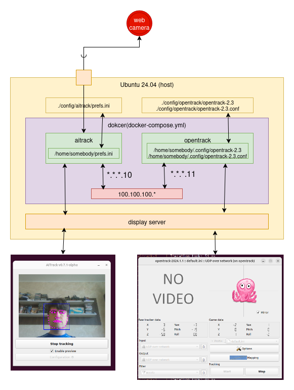

# opentrack and AITrack
opentack uses AITrack as input.\
AITrack here acts as a sensor(camera) for opentrack.\
opentrack and AITrack are running in separated containers.


# Setup infrasturcture
<p align="center"></p>


AITrack's setup in mounted from ***host*** into ***container***:\
***./config/aitrack/prefs.ini:/home/somebody/prefs.ini***

opentrack 's setup in mounted from ***host*** into ***container***:\
***./config/opentrack/opentrack-2.3:/home/somebody/.config/opentrack-2.3***
***./config/opentrack/opentrack-2.3.conf:/home/somebody/.config/opentrack-2.3.conf***


# To start the setup
```
bash ./up.sh
```
Here 2 apps shall come up:
* AITrack
* opentrack
<p align="center"></p>

Click ***Start tracking*** in ***AITrack*** window.\
AITrack start video capturing and face detection.
<p align="center"></p>

Click ***Start*** in ***opentrack*** window.\
***opentrack*** receives input from AITrack and performs head trackig.
<p align="center"></p>
<p align="center"></p>
<p align="center"></p>
<p align="center"></p>


# To stop the setup
```
bash ./down.sh
